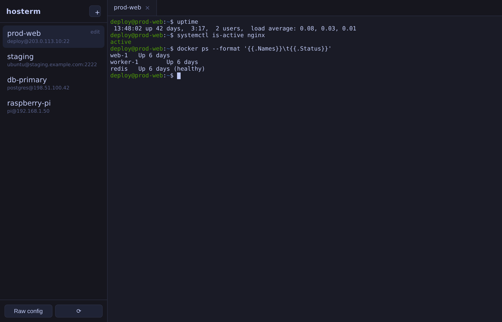
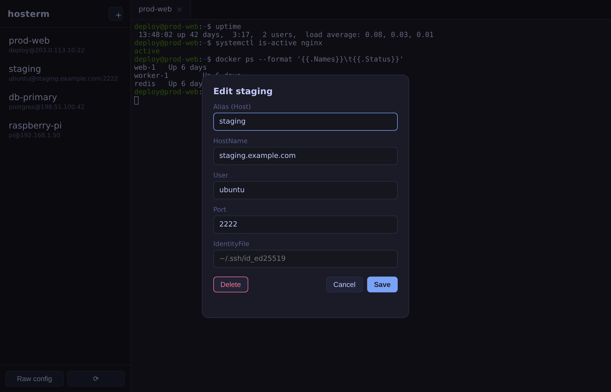

# hosterm

A lightweight desktop SSH client (Termius-style) whose **single source of truth is
`~/.ssh/config`** — no vault, no proprietary store. Switch devices by copying one file.

Built with Tauri v2 (Rust backend + web UI). Spawns the real OS `ssh` binary in an
embedded terminal, so everything in your `~/.ssh/config` is honored exactly as the
command line would honor it (ProxyJump, IdentityFile, forwarding, Match blocks, etc.).





> Screenshots use sample hosts; the app reads your real `~/.ssh/config`.

## Features

- Sidebar listing every `Host` entry from `~/.ssh/config`
- Click a host to open an embedded terminal tab (xterm.js); multiple tabs at once
- Add / edit / delete hosts via a form — writes straight back to `~/.ssh/config`,
  **preserving comments, ordering, and unknown directives** (round-trip safe)
- Choose auth per host: **key** (pick an `IdentityFile` from a dropdown) or
  **password** (ssh prompts you on connect — no secret is ever stored)
- **Create an identity key by pasting the private key text** — hosterm writes it
  to `~/.ssh/<name>` at `0600`, then it appears in the key dropdown (Termius-style)
- "Raw config" editor to hand-edit the file directly inside the app
- Config written atomically (temp + rename) and never overwritten with empty if
  an existing file can't be read; files get `0600` permissions on Unix
- No telemetry, no network calls except the SSH connections you start

## Authentication

OpenSSH's config format has no `Password` directive — passwords live only in a
client's vault, which hosterm deliberately avoids (the whole point is a portable
plain-text config). So:

- **Key auth** writes `IdentityFile`. Pick an existing key from the dropdown, or
  paste a new private key and hosterm saves it as a `0600` file beside the config.
- **Password auth** writes `PreferredAuthentications password` +
  `PubkeyAuthentication no`, and ssh prompts for the password in the embedded
  terminal at connect time. Nothing secret is stored, so copying your
  `~/.ssh/config` to another device stays safe and complete.

## How it stores config

There is no database. The app reads and writes `~/.ssh/config` directly using a
parser that keeps every line it does not understand verbatim. Pattern blocks
(`Host *`, wildcards) are shown read-only in the sidebar and never rewritten by the form.

Override the path for testing with the `HOSTERM_CONFIG` env var.

## Install (Windows)

Download `hosterm.exe` from the [Releases](https://github.com/MEKL20/hosterm/releases)
page and run it. Requires the **Microsoft Edge WebView2 Runtime**, which is preinstalled
on current Windows 10/11; on older installs, install it from Microsoft (free).

## Develop (Linux/macOS/Windows)

```bash
npm install
npm run tauri dev
```

Linux build deps (Debian/Ubuntu): `libwebkit2gtk-4.1-dev build-essential pkg-config
librsvg2-dev libssl-dev libxdo-dev libayatana-appindicator3-dev`.

## Build

```bash
npm install
npm run tauri build
```

To cross-build the Windows `.exe` from Linux, see
[`BUILD-WINDOWS-FROM-LINUX.md`](BUILD-WINDOWS-FROM-LINUX.md). The installer bundle
(NSIS `.exe` / WiX `.msi`) must be produced on Windows — the
[`.github/workflows/build-windows.yml`](.github/workflows/build-windows.yml) workflow
does this on a `windows-latest` runner (push a `v*` tag or trigger it manually).

## License

MIT — see [LICENSE](LICENSE).
